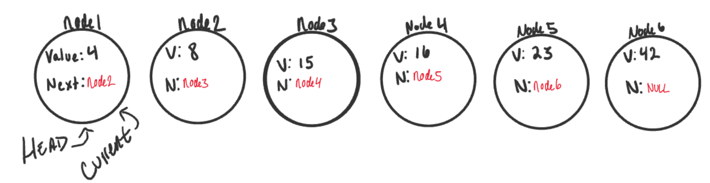

# Linked Lists

## What is a Linked List

In general A Linked List is a sequence of Nodes that are connected/linked to each other.

## Terminology:

* Linked List: A data structure that contains nodes that links/points to the next node in the list.
* Types of Linked List:
  1. Singly: Means that there is only one reference, and the reference points to the Next node in a linked list.
  2. Doubly: Means that there is a reference to both the Next and Previous node.
* Node: Nodes are the individual items/links that live in a linked list. Each node contains the data for each link.  
* Next: Is a property in the node that contains the reference to the next node.
* Head: Is the first node in a linked list and it is a reference of type Node.
* Current:Is a reference of type Node to the node that is currently being looked at.

## LinkedList example:

## Traversal:

When traversing a linked list, we depend on the **Next** value which guide us where the next reference is pointing. 

The best way to approach a traversal is a **while loop** which allow us to continually check if **Next** is not null and we need to throw a **NullReferenceException** to end our program.

The Current variable tell us where we are in the LinkedList and will allow us to move until the end.

***
## Types of Data structures:

* linear: Which means that there is a sequence and an order to how they are constructed and traversed.
* Non-linear: which mens that the items don’t have to be arranged in order and we can traverse it non-sequentially.

## Memory management:

The biggest difference between arrays and linked lists is the way that they use memory in our machines.

* arrays: When an array is created, it reserve an amount of the memory in one contiguous block.
* linked lists: When linked lists it created, the reserve an amount of the memory for it can be antwhere in the memory and it don’t need to take up a single block of memory.

